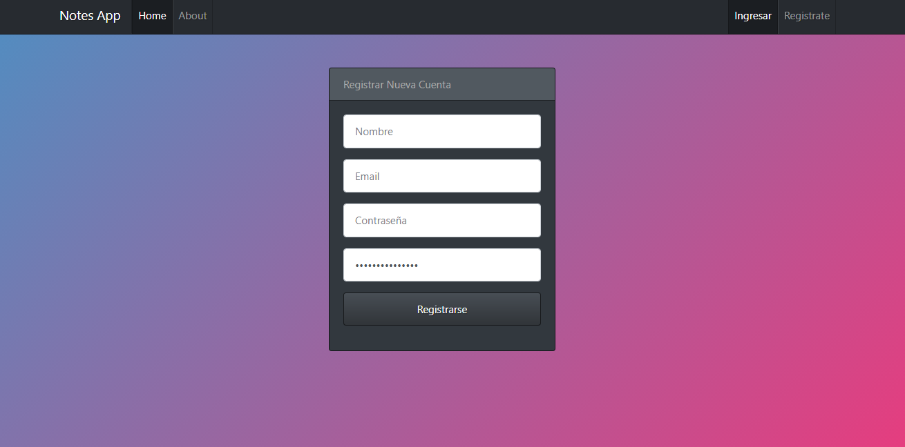
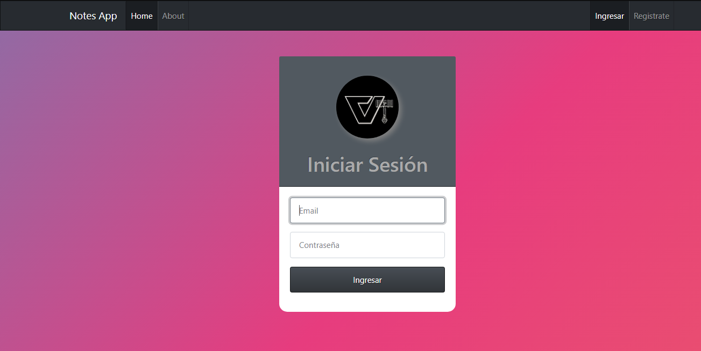

# Notes App 👨‍💻
Es una aplicacion, que cuenta con un login, cada usuario puede crear, editar, eliminar y listar
sus notas, backend, frontend y base de datos, realizada con Javascript 

# Tecnologias Utilizadas
- Nodejs
  - Express
  - HandleBars
- Mongodb

